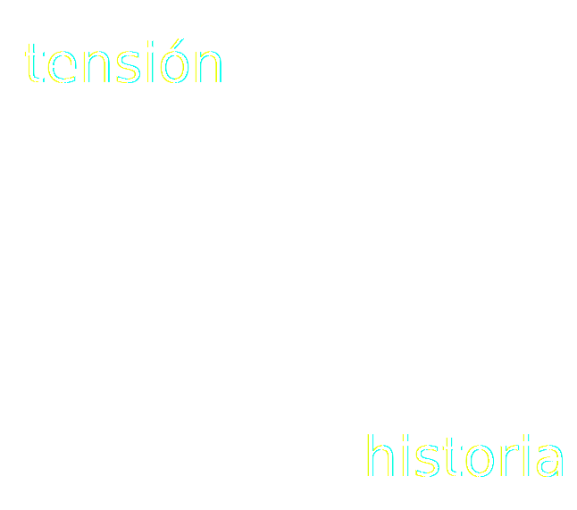
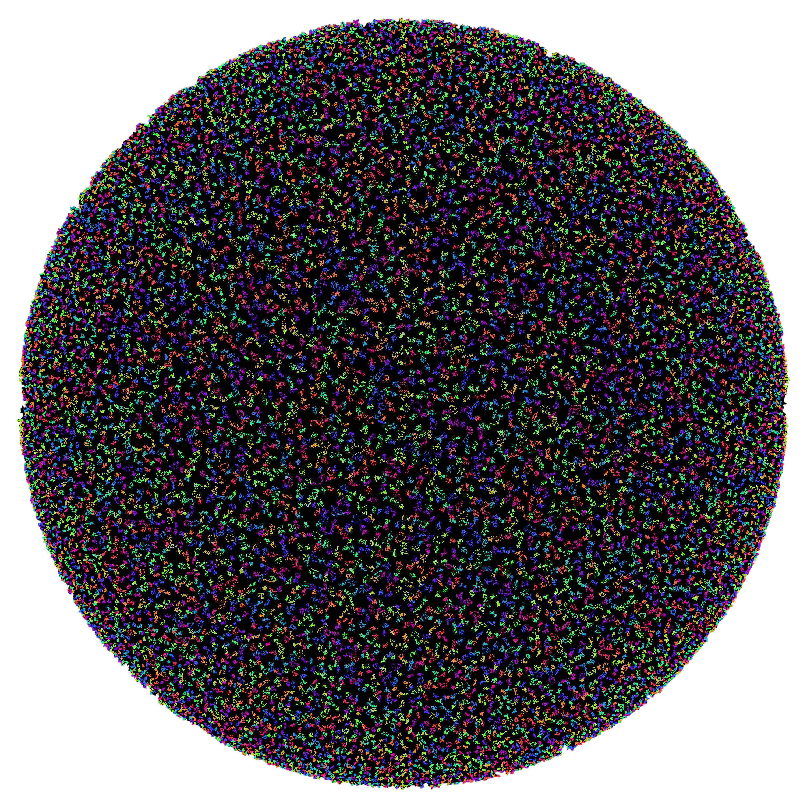

# Primero, conozcámonos

notes: 

- presentarme yo
- que cada uno diga su nombre, procedencia/background y cuenté **por qué está aquí**

- necesitamos
    - 20 bolis
    - 20 gomas
    - 20 lápices
    - 3 lanas
    - mucho papel
    - proyector
    - mesas
    - que se puedan mover
    - tijeras
    - clips de papel
...

# Resumen

Las computadoras carecen de las capacidades cognitivas humanas que nos permiten inventar historias de forma natural, por lo que el proceso de generar historias automáticamente es **muy diferente** al que usamos los humanos. En este taller experimentaremos cuáles son las restricciones que existen actualmente en los generadores automáticos de historias, y lo haremos convirtiéndonos en la computadora. Crearemos **una historia completa** a partir de elementos básicos, igual que lo hace un sistema automático. Veremos cómo las computadores entienden los personajes, su evolución, los eventos de la historia y los emociones que provocan mientras simulamos el funcionamiento de un sistema creativo computacional.

notes: explicar qué tenemos que hacer

...

# Pregunten siempre

notes: que, en cualquier momento, digan lo que sea

colaboración

...

# ¡Hagamos equipos!

(Cada equipo necesita un buen nombre)

Notes:
- crear los grupos aquí.
- 4 equipos

**30 min**

|||

# Peparación de nuestra primera historia

notes:

- repartir a cada grupo un conjunto de tarjetas
- papel y bolis para todos
- Contarles Georges Polti (15 December 1867 – June 194), francés, 36 situaciones dramáticas

...

# Crear nuestra primera historia

Componer, con las tarjetas, una historia

¡Busquemos la **creatividad**!

...

# Redactemos la historia en papel

Escribamos, en papel, la historia que hemos dispuesto

...

# Contemos la historia

Cada equipo, por turnos, puede contar su historia

|||

# Emociones

¿Qué es la vida sin *emoción*?

notes:

hablar de emociones en historias

MEXICA

Stella y emociones

...

# Evolución de las emociones

...

# El material

¡Hilos de lana!

notes:

- repartir lanas:

...

# Código de colores

## Azul: suspense

## Rojo: romance

## Blanco: humor

...

# Creemos la historia

Tiene que ser una historia diferente a la anterior

notes: aquí la crean

...

# Pongamos la historia en común

...

# Ahora, pensemos

- ¿Qué dificultades tenemos? <!-- .element: class="fragment" data-fragment-index="1" -->
- ¿Qué ha sido más sencillo? <!-- .element: class="fragment" data-fragment-index="2" -->
- ¿Todo lo que hemos escrito está en nuestras tarjetas? <!-- .element: class="fragment" data-fragment-index="3" -->
- ¿Qué hemos inventado cuando pasábamos la historia al papel? <!-- .element: class="fragment" data-fragment-index="4" -->
- ¿Es posible hacer otra historia con las mismas tarjetas? <!-- .element: class="fragment" data-fragment-index="5" -->
notes: 

**60 min**

|||

# Haciendo más computacional la generación

notes:

- porque la compu necesita condiciones **explícitas**

...

# El material

Nuevas tarjetas

...

# Las nuevas tarjetas

Ahora las acciones tienen una condición que debe cumplirse para que pueda ser aplicada

...

# El nuevo proceso

Cada vez que pongamos una acción, debemos asegurarnos de que se cumplen las precondiciones

...

# ¡Escribamos una nueva historia!

Y sigamos siendo creativos

...

# Tiempo para la reflexión

- ¿Cuántos personajes tengo? <!-- .element: class="fragment" data-fragment-index="1" -->
- ¿Qué sé de los personajes? <!-- .element: class="fragment" data-fragment-index="2" -->
- ¿Por qué sé tantas cosas de los personajes? <!-- .element: class="fragment" data-fragment-index="3" -->
- ¿Han ayudado las precondiciones, o lo han puesto más difícil? <!-- .element: class="fragment" data-fragment-index="4" -->

notes: **90 min**

- sé tantas cosas porque uso mi mente, pero no están explícitas
- se ha reducido el espacio de estados

|||

# Los problemas de una computadora

notes: contar que la compu **no sabe nada**

...

<!-- .element height="50%" width="50%" -->

La luna, como la vemos nosotros

...

<!-- .element height="50%" width="50%" -->

La luna, como la ve una máquina

|||

# Volvámonos programadores

...

Hemos visto anteriormente que los valores emocionales son *independientes del contexto*

...

Ahora vamos a hacerlos dependientes, y vamos a crear nosotros las reglas

...

# Nuevas tarjetas

Estas nuevas tarjetas tienen vacíos los huecos para los valores emocionales

Además, podremos incluir reglas contextuales

...

# Un personaje resbala y cae

## Suspense: +1 si el personaje es bueno, -1 si es malo

## Romance: 0, en cualquier caso

## Humor: +1 si se resuelve sin peligro

note: **ejemplo**

...

# Reflexión

- ¿Qué dificultades hemos encontrado? 
<!-- .element: class="fragment" data-fragment-index="1" -->
- ¿Somos creativos cuando programamos? <!-- .element: class="fragment" data-fragment-index="2" -->
- ¿Sigue siendo creativo el proceso de generación, o somos creativos los programadores? <!-- .element: class="fragment" data-fragment-index="3" -->

notes: **120min**

- para hechos nuevos, nuevas reglas

|||

# El algoritmo de generación

...

Hasta ahora hemos creado el proceso siguiendo nuestra intuición

Pero una computadora **no tiene intuición**

...

Las computadoras necesitan seguir un *algoritmo* de generación

|||

# Los ojos de una computadora

notes: ahora vamos a perder nuestro "sentido común", y vamos a trabajar, *de verdad*, como una compu

...

# Material nuevo

**Sin explicación**

Porque nadie le explica nada a una computadora

notes: 

- fichas con letras, hoja de personaje con letras

...

# (Bueno, un poco de explicación)

notes: explicar

...

# ¡Generemos como una máquina!

...

# Reflexión

- ¿Cómo podemos saber si la historia está bien hecha? <!-- .element: class="fragment" data-fragment-index="1" -->
- ¿Cómo podemos hacer que un ordenador la evalúe? <!-- .element: class="fragment" data-fragment-index="2" -->

notes: **150min**

|||

# Y, finalmente...

...

# ... ¡colaboremos!

...

Vamos a crear un sistema colaborativo

...

Cada entidad tendrá un rol en la generación

...

Diseñemos nosotros el programa

notes: ir apuntándolo, y hacerlo con ellos

**180min**

|||

# Resumen

- Dificultades para generar historias <!-- .element: class="fragment" data-fragment-index="1" -->
- Muchas maneras <!-- .element: class="fragment" data-fragment-index="2" -->
- Las computadoras no tienen nuestra capacidad <!-- .element: class="fragment" data-fragment-index="3" -->
- El programador define el proceso <!-- .element: class="fragment" data-fragment-index="4" -->

